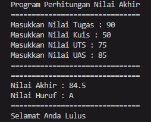
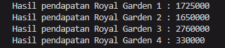
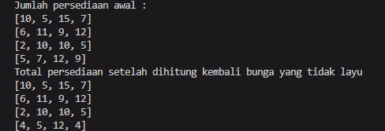
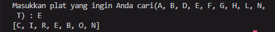
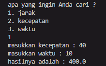

# Laporan Projek 1
### Aryo Adi Putro / 2341720084 / TI-1H

## Praktikum Pemilihan

Hasil output jika nilai yang dimasukkan tidak valid : 

.png>)

Hasil output jika nilai yang dimasukkan memenuhi kriteria : 

## Praktikum Perulangan

Hasil output : 

-1.png>)
## Praktikum Array

Hasil output : 

.png>)

## Praktikum Fungsi

Hasil output total pendapatan tiap toko :

Hasil output setelah pengurangan stok karena layu : 

## Tugas

1. Hasil output dari pencarian kota berdasarkan kode plat huruf :

2. Hasil output perhitungan dari rumus :

