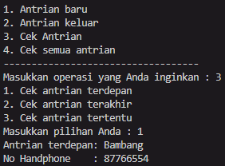

# Laporan Praktikum JobSheet 8

## Aryo Adi Putro/06

## Percobaan 1

### Hasil percobaan 1

> 

### Pertanyaan percobaan 1

1. Pada konstruktor, mengapa nilai awal atribut front dan rear bernilai -1, sementara atribut size bernilai 0?
- Untuk menandakan bahwa queue masih kosong. Oleh karena itu front dan rear bernilai -1. Akan berubah jika terdapt queue baru ditambahkan.

2. Pada method Enqueue, jelaskan maksud dan kegunaan dari potongan kode berikut!
```java 
if(this.rear == this.max - 1) {
    this.rear = 0;
```
- Untuk menjadikan nilai rear 0 agar saat dilakukan penambahan queue berikutnya sistem mendeteksi bahwa queue telah penuh.

3. Pada method Dequeue, jelaskan maksud dan kegunaan dari potongan kode berikut:
``` java
if(this.front == this.max -1) {
    this.front = 0;
```
- Mengembalikan nilai front menjadi 0 apabila nilai front telah mencapai batas maksimal.

4. Pada method print, mengapa pada proses perulangan variabel i tidak dimulai dari 0 (int i=0), melainkan int i=front?
- Karena data pertama tidak selalu berada di index 0, maka dilakukan print pada index front.

5. Perhatikan kembali method print, jelaskan maksud dari potongan kode berikut!
``` java
i = (i + 1) % max;
```
-   Untuk melakukan perulangan setelah mencapai batas tertentu.

6. Tunjukkan potongan kode program yang merupakan queue overflow!
``` java
boolean isFull() {
    if (size == max) {
        return true;
    } else {
        return false;
    }
}
```
7. Pada saat terjadi queue overflow dan queue underflow, program tersebut tetap dapat berjalan dan hanya menampilkan teks informasi. Lakukan modifikasi program sehingga pada saat terjadi queue overflow dan queue underflow, program dihentikan!
``` java
boolean over, under;

if(q.over == true || q.under == true) {
    break;
}
```

## Percobaan 2

### Hasil Percobaan 2

> 

### Pertanyaan percobaan 2

1. Pada class QueueMain, jelaskan fungsi IF pada potongan kode program berikut!
``` java
if(!"".equals(data.norek) && !"".equals(data.nama) && !"".equals(data.alamat) && (data.umur) != 0 && (data.saldo) != 0) {
    System.out.println("Antrian yang keluar : " + data.norek + " " + data.nama + " " + data.alamat + " " + data.umur + " " + data.saldo);
}
```
- Potongan program tersebut ditujukan untuk mencetak data yang keluar jika data itu tidak kosong.

2. Lakukan modifikasi program dengan menambahkan method baru bernama peekRear pada class Queue yang digunakan untuk mengecek antrian yang berada di posisi belakang! Tambahkan pula daftar menu 5. Cek Antrian paling belakang pada class QueueMain sehingga method peekRear dapat dipanggil!
``` java
case 4 :
    q.peekrear();

    break;
```
``` java
void peekrear() {
    if(!isEmpty()) {
        System.out.println("Elemen terakhir : " + data[this.rear].norek + " " + data[this.rear].nama + " " + data[this.rear].alamat + " " + data[this.rear].umur + " " + data[this.rear].saldo);
    } else {
        System.out.println("Queue masih kosong");
    }
}
```
- Hasil run : 
- Antrian terdepan
> 

- Antrian terakhir
> 

- Semuan antrian
> 

## Tugas

1. Buatlah program antrian untuk mengilustasikan pesanan disebuah warung. Ketika seorang pembeli akan mengantri, maka dia harus mendaftarkan nama, dan nomor HP seperti yang digambarkan pada Class diagram berikut:
> 
>
Class diagram Queue digambarkan sebagai berikut:
> 
>

- Hasil run : 
- Input antrian
> 

- Mengeluarkan antrian
> 

- Peek antrian terdepan
> 

- Peek antrian terakhir
> 

- Peek antrian berdasarkan nama serta posisinya
> 

- Cek semua antrian
> 