# Laporan Praktikum Jobsheet 10

## Aryo Adi Putro/06

## Percobaan 1

### Hasil percobaan 1

> 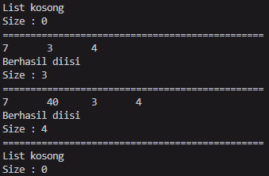

### Pertanyaan percobaan 1

1. Jelaskan perbedaan antara single linked list dengan double linked lists!
- Single linked list hanya bisa menjalankan satu arah(next), sedangkan untuk double linked list bisa melakukan secara dua arah(prev & next).

2. Perhatikan class Node, di dalamnya terdapat atribut next dan prev. Untuk apakah atribut tersebut?
- Sebagai penunjuk akan mengarah kedepan(next) atau kebelakang(prev).

3. Perhatikan konstruktor pada class DoubleLinkedLists. Apa kegunaan inisialisasi atribut head dan
size seperti pada gambar berikut ini?
``` java
doubleLinkedList() {
    this.head = null;
    this.size = 0;
}
```
- Untuk mengisi nilai awal linked list tanpa adanya nilai.

4. Pada method addFirst(), kenapa dalam pembuatan object dari konstruktor class Node prev dianggap sama dengan null? Node newNode = new Node(null, item, head);
- Karena sesuai dengan namanya, addfirst yang mana akan menambahkan data di paling awal dari data-data yang telah diisi, maka prev nya diisi dengan null.

5. Perhatikan pada method addFirst(). Apakah arti statement head.prev = newNode ?
- Menambahkan data baru sebelum head sebelum diisi nilainya.

6. Perhatikan isi method addLast(), apa arti dari pembuatan object Node dengan mengisikan
parameter prev dengan current, dan next dengan null?
- Node newNode = new Node(current, item, null);
- Karena data ditambahkan diakhir linked list, maka next hari node yang akan diisikan adalah null karena tidak ada data setelahnya.

7. Pada method add(), terdapat potongan kode program sebagai berikut:
jelaskan maksud dari bagian yang ditandai dengan kotak kuning.
``` java
if(current.prev == null) {
    node newNode = new node(null, data, current);
    current.prev = newNode;
    head = newNode;
}
```
- Membuat data pada index yang telah ditentukan pada data diantara dua data yang ada sebelum dibuatnya data baru. Jika data sebelum current adalah null, maka akan dibuat data baru sebelum current.

## Percobaan 2

### Hasil percobaan 2

> 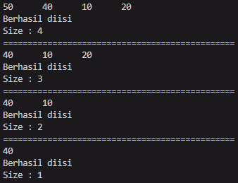

### Pertanyaan pecobaan 2

1. Apakah maksud statement berikut pada method removeFirst()?
``` java
head = head.next;
head.prev = null;
```
- Memindah posisi head ke posisi didepannya, kemudian menghilangkan atau menghapus data pada head sebelum dipindah.

2. Bagaimana cara mendeteksi posisi data ada pada bagian akhir pada method removeLast()?
- Terdapat pada baris kode berikut :
``` java
else if(head.next == null) {
    head = null;
    size--;
    return;
}
```
- Dengan menyeleksi apakah setelah head adalah null. Jika iya maka head akan dihapus.

3. Jelaskan alasan potongan kode program di bawah ini tidak cocok untuk perintah remove!
``` java
node tmp = head.next;

head.next = tmp.next;
tmp.next.prev = head;
```
- Karena jika menggunakan kode tersebut, maka next(tail) dari head tidak akan terisi dan kode program akan menjadi error.

4. Jelaskan fungsi kode program berikut ini pada fungsi remove!
``` java
current.prev.next = current.next;
current.next.prev = current.prev;
```
- Untuk mengisi prev(head) dan next(tail) dari current.

## Percobaan 3

### Hasil percobaan 3

> 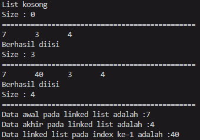

### Pertanyaan percobaan 3

1. Jelaskan method size() pada class DoubleLinkedLists!
- Untuk menyimpan nilai size yang ada dalam doubleLinkedList.

2. Jelaskan cara mengatur indeks pada double linked lists supaya dapat dimulai dari indeks ke-1!
- Dengan mengisi nilai awal head menjadi 1.

3. Jelaskan perbedaan karakteristik fungsi Add pada Double Linked Lists dan Single Linked Lists!
- Dalam single linked list tidak perlu untuk mengisi nilai prev karena hanya ada satu arah(next) dalam single linked list sedangkan dalam double linked list diperlukan untuk mengisi data tersebut.

4. Jelaskan perbedaan logika dari kedua kode program di bawah ini!
``` java
public boolean isEmpty() {
    if(size == 0) {
        return true;
    } else {
        return false;
    }
}
```
``` java
boolean isEmpty() {
    return head == null;
}
```
- Perbedaan antara keduanya adalah di kode program yang pertama menggunakan pemilihan terlebih dahulu dan hasilnya akan dikeluarkan sebelum keluar dari method isEmpty, jika benar akan mengembalikan nilai true, begitu juga sebaliknya. Sedangnkan pada baris kode program yang kedua langsung mengembalikan nilai return head == null yang mana saat dilakukan pemanggilan baru mengeluarkan hasilnya yang mana jika benar akan mengembalikan nilai true, begitu juga sebaliknya.

## Tugas

1. Buat program antrian vaksinasi menggunakan queue berbasis double linked list sesuai ilustrasi
dan menu di bawah ini! (counter jumlah antrian tersisa di menu cetak(3) dan data orang yang telah divaksinasi di menu Hapus Data(2) harus ada)

- Hasil running program :
> 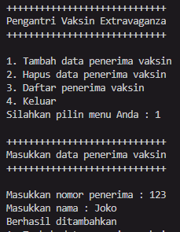
> 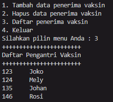
> 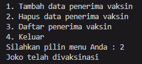

2. Buatlah program daftar film yang terdiri dari id, judul dan rating menggunakan double linked
lists, bentuk program memiliki fitur pencarian melalui ID Film dan pengurutan Rating secara descending. Class Film wajib diimplementasikan dalam soal ini.

- Hasil running program :
> 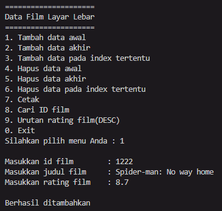
> 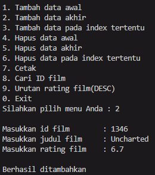
> 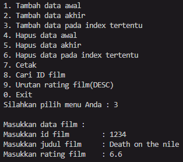
> 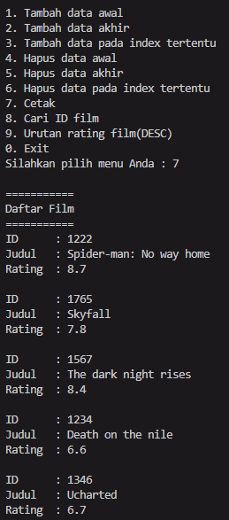
> 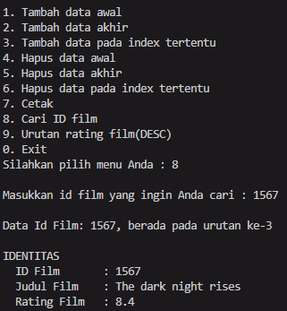