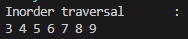
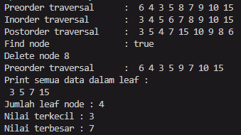
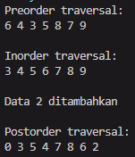

# Laporan Praktikum Jobsheet 13

## Aryo Adi Putro/06

## Percobaan 1

### Hasil percobaan 1

> 

### Pertanyaan percobaan 1

1. Mengapa dalam binary search tree proses pencarian data bisa lebih efektif dilakukan dibanding binary tree biasa?
- Karena BST memiliki struktur yang disiplin dan terorganisir karena hanya memiliki 2 child maksimal untuk tiap parentnya, sehingga memudahkan pencarian data.

2. Untuk apakah di class Node, kegunaan dari atribut left dan right?
- Untuk memutuskan dimana data akan diletakkan. Jika data lebih besar dari data yang akan menjadi parentnya, maka akan dijadikan child sebelah kiri, dan akan diletakkan disebelah kanan jika data lebih besar dari data yang akan menjadi parentnya.

3. Jawab pertanyaan berikut!

        a. Untuk apakah kegunaan dari atribut root di dalam class BinaryTree?
        - Atribut root akan digunakan sebagai node induk dari struktur data pohon biner.

        b. Ketika objek tree pertama kali dibuat, apakah nilai dari root?
        - Nilai root saat objek pertama kali dibuat adalah null, akan memiliki nilai hanya jika data telah diisi.

4. Ketika tree masih kosong, dan akan ditambahkan sebuah node baru, proses apa yang akan terjadi?
- Node baru akan diinisialisasikan sebagai root baru dalam tree tersebut.

5. Perhatikan method add(), di dalamnya terdapat baris program seperti di bawah ini. Jelaskan secara detil untuk apa baris program tersebut?
``` java
if(data<current.data){
    if(current.left!=null){
        current = current.left;
    }else{
        current.left = new Node(data);
        break;
    }
}
```
- Untuk pengisian data baru dalam tree sekaligus menentukan peletakan posisi data dalam tree tersebut.

## Percobaan 2

### Hasil percobaan 2

> 

### Pertanyaan percobaan 2

1. Apakah kegunaan dari atribut data dan idxLast yang ada di class BinaryTreeArray?
- Untuk menyimpan nilai batas perulangan yang nantinya akan digunakan dalam traverse.

2. Apakah kegunaan dari method populateData()?
- Untuk memberi nilai data pada class binaryTreeArray.

3. Apakah kegunaan dari method traverseInOrder()?
- Untuk menampilkan nilai data secara berurutan mulai dari nilai yang terkecil.

4. Jika suatu node binary tree disimpan dalam array indeks 2, maka di indeks berapakah posisi left child dan rigth child masing-masing?
- Posisi left child akan berada di index ke 3, sedangkan index ke 4 akan diisi oleh right child.

5. Apa kegunaan statement int idxLast = 6 pada praktikum 2 percobaan nomor 4?
- Sebagai batas penampilan data, yaitu pada index keenam pada array.

## Tugas

1. Buat method di dalam class BinaryTree yang akan menambahkan node dengan cara rekursif.
2. Buat method di dalam class BinaryTree untuk menampilkan nilai paling kecil dan yang paling besar yang ada di dalam tree.
3. Buat method di dalam class BinaryTree untuk menampilkan data yang ada di leaf.
4. Buat method di dalam class BinaryTree untuk menampilkan berapa jumlah leaf yang ada di dalam tree.
5. Modifikasi class BinaryTreeArray, dan tambahkan :
- method add(int data) untuk memasukan data ke dalam tree
- method traversePreOrder() dan traversePostOrder()

- Hasil run :

- Binary tree : 
> 

- Binary tree array : 
> 