# Laporan Jobsheet 15

## Aryo Adi Putro/06

## Percobaan 1

### Hasil Percobaan 1

> 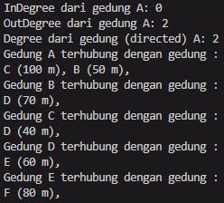
- Setelah penghapusan
> 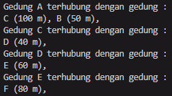

### Pertanyaan percobaan 1

1. Perbaiki kode program Anda apabila terdapat error atau hasil kompilasi kode tidak sesuai!
2. Pada class Graph, terdapat atribut list[] bertipe DoubleLinkedList. Sebutkan tujuan pembuatan variabel tersebut!
- Untuk menyimpan data vertex yang telah dibuat.

3. Jelaskan alur kerja dari method removeEdge!
- Menerima parameter dari main class yang kemudian dilakukan perulangan hingga data yang ada pada parameter(tujuan) sesuai dengan data yang akan dihapus.

4. Apakah alasan pemanggilan method addFirst() untuk menambahkan data, bukan method add jenis lain saat digunakan pada method addEdge pada class Graph?
- Untuk memastikan data yang dimasukkan menjadi head dari node.

5. Modifikasi kode program sehingga dapat dilakukan pengecekan apakah terdapat jalur antara suatu node dengan node lainnya, seperti contoh berikut (Anda dapat memanfaatkan Scanner).
> 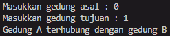
> 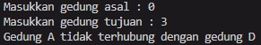

## Percobaan 2

### Hasil percobaan 2

> 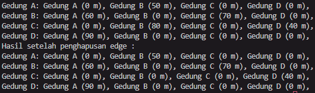

### Pertanyaan percobaan 2

1. Perbaiki kode program Anda apabila terdapat error atau hasil kompilasi kode tidak sesuai!
2. Apa jenis graph yang digunakan pada Percobaan 2?
- Jenis graph yang digunakan adalah jenis matriks

3. Apa maksud dari dua baris kode berikut?
``` java
    gdg.makeEdge(0, 1, 50);
    gdg.makeEdge(1, 0, 60);
```
- Maksud dari baris kode tersebut adalah penambahan vertex kedalam graph.

4. Modifikasi kode program sehingga terdapat method untuk menghitung degree, termasuk inDegree dan outDegree!
``` java
public void degree(int asal) {
    int totalIn = 0, totalOut = 0;
    for (int i = 0; i < vertex; i++) {
        //indegree
        if (matriks[i][asal] != 0) {
            totalIn++;
        }
        //outdegree
        if (matriks[asal][i] != 0) {
            totalOut++;   
        }
    }
    System.out.println("InDegree dari Gedung " + (char) ('A' + asal) + "    : " + totalIn);
    System.out.println("OutDegree dari Gedung " + (char) ('A' + asal) + "   : " + totalOut);
    System.out.println("Degree dari Gedung " + (char) ('A' + asal) + "      : " + (totalIn + totalOut));
}
```
> 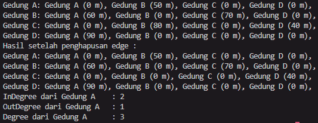

## Tugas

1. Modifikasi kode program pada class GraphMain sehingga terdapat menu program yang bersifat
dinamis, setidaknya terdiri dari:
- a. Add Edge
- b. Remove Edge
- c. Degree
- d. Print Graph
- e. Cek Edge

Pengguna dapat memilih menu program melalui input Scanner

2. Tambahkan method updateJarak pada Percobaan 1 yang digunakan untuk mengubah jarak antara dua node asal dan tujuan!
3. Tambahkan method hitungEdge untuk menghitung banyaknya edge yang terdapat di dalam graf!

- Hasil run :
> 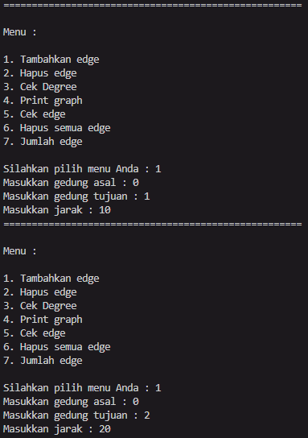
>
> 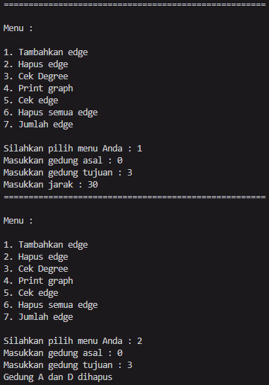
>
> 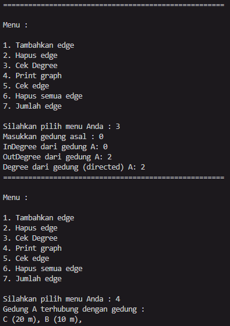
>
> 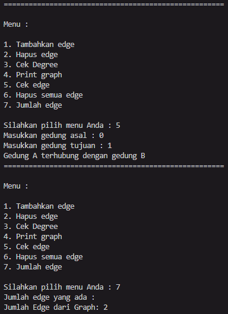
>
> 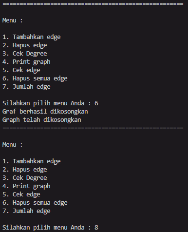