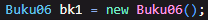
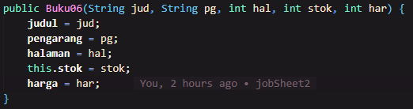
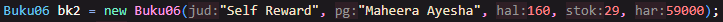
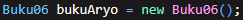

# Laporan Projek 2

### Aryo Adi Putro / 2341720084 / TI-1H

### Pertanyaan 2.1.

> 1.  Sebutkan dua karakteristik class atau object!

- Sebuah class public bisa diakses meskipun berbeda folder dengan pengakses, hanya jika dalam pengakses telah mengimpor folder dari class yang ingin diakses.
- Sebuah class private hanya bisa diakses jika pengakses berada dalam satu file yang sama dengan yang diakses.

  > 2. Perhatikan class Buku pada Praktikum 1 tersebut, ada berapa atribut yang dimiliki oleh class Buku? Sebutkan apa saja atributnya!
  >
  > terdapat 5 atribut, antara lain :

- String judul,
- String pengarang,
- int halaman,
- int stok,
- int harga.

> 3. Ada berapa method yang dimiliki oleh class tersebut? Sebutkan apa saja methodnya!
>
> Terdapat 4 method dalam class tersebut, antara lain :

- void tampilInformasi(),
- void terjual(int jml),
- void restok(int n),
- int gantiHarga(int hrg).

> 4. Perhatikan method terjual() yang terdapat di dalam class Buku. Modifikasi isi method tersebut sehingga proses pengurangan hanya dapat dilakukan jika stok masih ada (lebih besar dari 0)!
>
> 

> 5. Menurut Anda, mengapa method restock() mempunyai satu parameter berupa bilangan int?

- Karena tidak mungkin untuk jumlah stok adalah setengah atau bilangan koma lain, oleh karena itu menggunakan int.

> 6. Commit dan push kode program ke Github

### Pertanyaan 2.2

> 1. Pada class BukuMain, tunjukkan baris kode program yang digunakan untuk proses instansiasi! Apa nama object yang dihasilkan?

- Nama objek yang dihasilkan adalah bk1.

> 2. Bagaimana cara mengakses atribut dan method dari suatu objek?

- Dengan menggunakan tanda "." setelah memanggil method dari objek tersebut.

> 3. Mengapa hasil output pemanggilan method tampilInformasi() pertama dan kedua berbeda?

- Karena terdapat operasi yang dilakukan diantara kedua pemanggilan method tersebut yang mengakibatkan hasil dari keduanya berbeda.

### Pertanyaan 2.3

> 1.  Pada class Buku di Percobaan 3, tunjukkan baris kode program yang digunakan untuk mendeklarasikan konstruktor berparameter!

- 

> 2.  Perhatikan class BukuMain. Apa sebenarnya yang dilakukan pada baris program berikut?

- Pada baris tersebut merupakan instansiasi dari objek, termasuk pengisian data yang diperlukan untuk mengisi objek tersebut.

> 3. Hapus konstruktor default pada class Buku, kemudian compile dan run program. Bagaimana hasilnya? Jelaskan mengapa hasilnya demikian!

- Akan terjadi error karena objek yang dibuat tidak memiliki class atau tidak memiliki programnya sendiri untuk sampai bisa dibuat objek.

> 4. Setelah melakukan instansiasi object, apakah method di dalam class Buku harus diakses secara berurutan? Jelaskan alasannya!

- Tidak, karena method tersebut bisa diakses tanpa harus diakses berurutan ataupun tidak sama sekali.

> 5. Buat object baru dengan nama buku<NamaMahasiswa> menggunakan konstruktor berparameter dari class Buku!

> 6. Commit dan push kode program ke Github