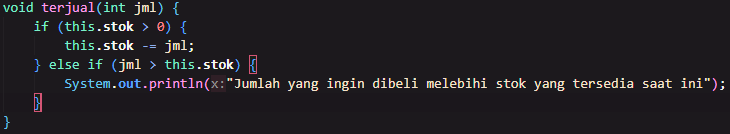

# Laporan Projek 2

### Aryo Adi Putro / 2341720084 / TI-1H

### Pertanyaan 2.1.3

> 1.  Sebutkan dua karakteristik class atau object!

- Sebuah class public bisa diakses meskipun berbeda folder dengan pengakses, hanya jika dalam pengakses telah mengimpor folder dari class yang ingin diakses.
- Sebuah class private hanya bisa diakses jika pengakses berada dalam satu file yang sama dengan yang diakses.

  > 2. Perhatikan class Buku pada Praktikum 1 tersebut, ada berapa atribut yang dimiliki oleh class Buku? Sebutkan apa saja atributnya!
  >
  > terdapat 5 atribut, antara lain :

- String judul,
- String pengarang,
- int halaman,
- int stok,
- int harga.

> 3. Ada berapa method yang dimiliki oleh class tersebut? Sebutkan apa saja methodnya!
>
> Terdapat 4 method dalam class tersebut, antara lain :

- void tampilInformasi(),
- void terjual(int jml),
- void restok(int n),
- int gantiHarga(int hrg).

> 4. Perhatikan method terjual() yang terdapat di dalam class Buku. Modifikasi isi method tersebut sehingga proses pengurangan hanya dapat dilakukan jika stok masih ada (lebih besar dari 0)!
>
> 

> 5. Menurut Anda, mengapa method restock() mempunyai satu parameter berupa bilangan int?

- Karena tidak mungkin untuk jumlah stok adalah setengah atau bilangan koma lain, oleh karena itu menggunakan int.

> 6. Commit dan push kode program ke Github
