# Laporan Projek 3

## Percobaan 1

### Hasil percobaan 1

> 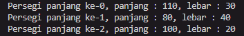

### Pertanyaan percobaan 1

1. Berdasarkan uji coba 3.2, apakah class yang akan dibuat array of object harus selalu memiliki atribut dan sekaligus method?Jelaskan!

- Tidak, jika hanya ingin membuat objek, tidak diperlukan untuk membuat atribut juga. Namun jika ingin memberi nilai dari objek tersebut mengharuskan untuk membuat atribut dalam classnya. Begitupun dengan method, juga harus dibuat jika memang diperlukan.

2. Apakah class PersegiPanjang memiliki konstruktor?Jika tidak, kenapa dilakukan pemanggilan konstruktur pada baris program berikut :
   > 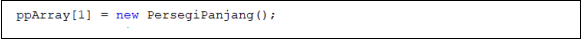

- Tidak, hal tersebut sudah merupakan hal yang harus dilakukan untuk instansiasi sebuah objek meskipun classnya tidak memiliki konstruktor.

3. Apa yang dimaksud dengan kode berikut ini:
   > 

- instansiasi sebuah objek.

4. Apa yang dimaksud dengan kode berikut ini:
   > 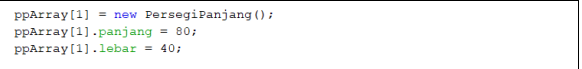

- Deklarasi sebuah atribut dari objek.

5. Mengapa class main dan juga class PersegiPanjang dipisahkan pada uji coba 3.2?

- Tidak ada alasan khusus, meskipun dijadikan satu file juga sama saja. Berbeda jika class dari salah satu file tersebut dijadikan private yang mengharuskan untuk dijadikan dalam satu file.

## Percobaan 2

### Hasil Percobaan 2

> 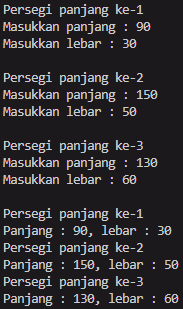

### Pertanyaan percobaan 2

1. Apakah array of object dapat diimplementasikan pada array 2 Dimensi?

- Ya, bisa.

2. Jika jawaban soal no satu iya, berikan contohnya! Jika tidak, jelaskan!

- 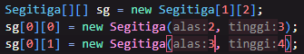

3. Jika diketahui terdapat class Persegi yang memiliki atribut sisi bertipe integer, maka kode dibawah ini akan memunculkan error saat dijalankan. Mengapa?
   > 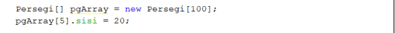

- Objek tersebut belum di instansiasi

4. Modifikasi kode program pada praktikum 3.3 agar length array menjadi inputan dengan Scanner!

   > 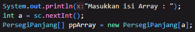

5. Apakah boleh Jika terjadi duplikasi instansiasi array of objek, misalkan saja instansiasi dilakukan pada ppArray[i] sekaligus ppArray[0]?Jelaskan!

- Ya boleh, kedua objek tersebut akan menjadi 2 objek yang berbeda karena perbedaan dalam nama saat instansiasi.

## Percobaan 3

### Hasil percobaan 3

> 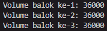

### Pertanyaan percobaan 3

1. Dapatkah konstruktor berjumlah lebih dalam satu kelas? Jelaskan dengan contoh!

- Ya bisa, seperti misal membuat 2 konstruktor tanpa parameter dan juga dengan parameter. Saat instansiasi objek, kita bisa memilih untuk instansiasi menggunakan parameter atau tidak menggunakan parameter. Keduanya tetap akan sama-sama tidak terjadi error.

2. Jika diketahui terdapat class Segitiga seperti berikut ini:

   > 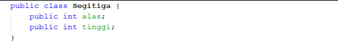
   > Tambahkan konstruktor pada class Segitiga tersebut yang berisi parameter int a, int t yang masing-masing digunakan untuk mengisikan atribut alas dan tinggi.

3. Tambahkan method hitungLuas() dan hitungKeliling() pada class Segitiga tersebut. Asumsi segitiga adalah segitiga siku-siku. (Hint: Anda dapat menggunakan bantuan library Math pada Java untuk mengkalkulasi sisi miring)

4. Pada fungsi main, buat array Segitiga sgArray yang berisi 4 elemen, isikan masing-masing atributnya sebagai berikut:

   > sgArray ke-0 alas: 10, tinggi: 4
   > sgArray ke-1 alas: 20, tinggi: 10
   > sgArray ke-2 alas: 15, tinggi: 6
   > sgArray ke-3 alas: 25, tinggi: 10

5. Kemudian menggunakan looping, cetak luas dan keliling dengan cara memanggil method hitungLuas() dan hitungKeliling().
   > (Jawaban untuk nomor 2, 3, 4, dan 5 bisa dilihat dalam file Segitiga.java)

> Hasil run pertanyaan percobaan 3
> 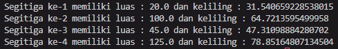

## Latihan

1. Buatlah program yang dapat menghitung luas permukaan dan volume bangun ruang kerucut, limas segi empat sama sisi, dan bola. Buatlah 3 (tiga) class sesuai dengan jumlah jenis bangun ruang. Buatlah satu main class untuk membuat array of objects yang menginputkan atribut-atribut yang ada menggunakan konstruktor semua bangun ruang tersebut. Dengan ketentuan,

- Buat looping untuk menginputkan masing-masing atributnya, kemudian tampilkan luas permukaan dan volume dari tiap jenis bangun ruang tersebut.
- Pada kerucut, inputan untuk atribut hanya jari-jari dan sisi miring
- Pada limas segi empat sama sisi, inputan untuk atribut hanya panjang sisi alas dan tinggi limas
- Pada bola, inpuntan untuk atribut hanya jari-jari

- Hasil run :
> 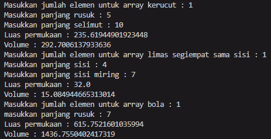

2. Sebuah kampus membutuhkan program untuk menampilkan informasi mahasiswa berupa nama, nim, jenis kelamin dan juga IPK mahasiswa. Program dapat menerima input semua informasi tersebut, kemudian menampilkanya kembali ke user. Implementasikan program tersebut jika dimisalkan terdapat 3 data mahasiswa yang tersedia. Contoh output program:
   > 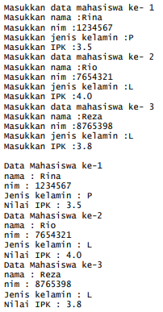
- Hasil run : 
> 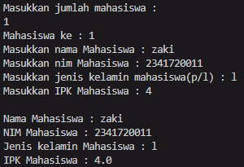

3.  Modifikasi program Latihan no.2 di atas, sehingga bisa digunakan untuk menghitung rata-rata IPK, serta menampilkan data mahasiswa dengan IPK terbesar! (gunakan method untuk masing-masing proses tersebut)
- Hasil run :
> 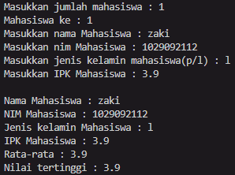