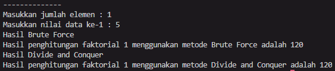
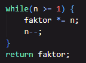
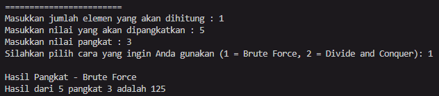
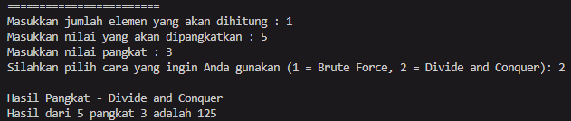
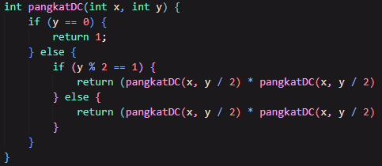
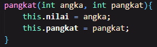
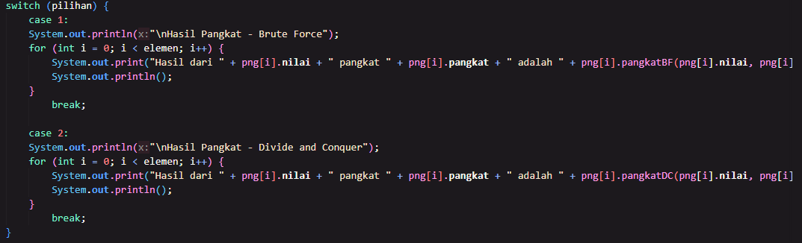
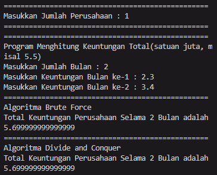
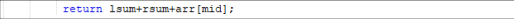
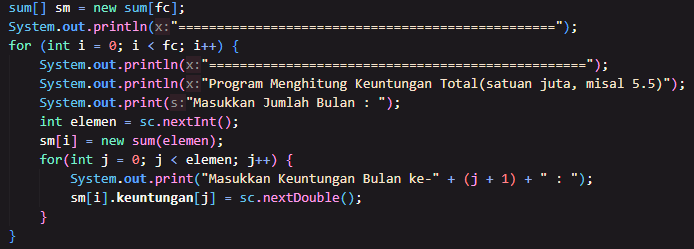

# Laporan Projek

## Percobaan 1

### Hasil percobaan 1

> 

### Pertanyaan pecobaan 1

1. Pada base line Algoritma Divide Conquer untuk melakukan pencarian nilai faktorial, jelaskan perbedaan bagian kode pada penggunaan if dan else!

- Untuk penggunaan if dalam baris tersebut adalah sebagai batas dari perulangan rekursif, sedangkan else dalam baris tersebut adalah sebagai baris penggunaan metode rekursif.

2. Apakah memungkinkan perulangan pada method faktorialBF() dirubah selain menggunakan for? Buktikan!

- Jika yang dimaksud adalah menggunakan metode perulangan yang lain, masih memungkinkan dengan menggunakan metode while ataupun do while. Namun jika menggunakan metode rekursif, akan menjadi metode divide and conquer.

> 

3. Jelaskan perbedaan antara fakto _= i; dan int fakto = n _ faktorialD(n-1);

- fakto _= adalah perkalian sederhana antara fakto dengan i, sedangkan fakto = n _ faktorialD(n-1) adalah perkalian menggunakan metode rekursif yang dilakukan hingga mencapai batas berhenti.

## Percobaan 2

### Hasil percobaan 2

>  > 

### Pertanyaan percobaan 2

1. Jelaskan mengenai perbedaan 2 method yang dibuat yaitu PangkatBF() dan PangkatDC()!

- Pada pangkatBF(), metode yang digunakan adalah brute force yang mana melakukan perkalian nilai yang dimasukkan sejumlah jumlah pangkat yang dimasukkan juga hingga jumlah pangkat mencapai batas dari pengulangan perkalian pangkat. Sedangkan pada pangkatDC metode yang digunakan adalah divide and conquer yang mana melalui tahapan pembagian jumlah pangkat terlebih dahulu, kemudian ditambahkan jumlah kali yang telah dimasukkan sejumlah jumlah pangkat yang telah dibagi sebelumnya. Lalu dilakukan metode rekursif untuk mengulangi tahapan sebelumnya.

2. Apakah tahap combine sudah termasuk dalam kode tersebut?Tunjukkan!

- Tidak, dalam penggunaan metode divide and conquer yang dilakukan adalah pembagian angka pangkat, namun tidak dipisah dan dilakukan operasi di tiap bagiannya.
  > 

3. Modifikasi kode program tersebut, anggap proses pengisian atribut dilakukan dengan konstruktor.

> 

4. Tambahkan menu agar salah satu method yang terpilih saja yang akan dijalankan menggunakan switch-case!

> 

## Percobaan 3

### Hasil percobaan 3

> 

### Pertanyaan percobaan 3

1. Mengapa terdapat formulasi return value berikut? Jelaskan!
   > 

- Untuk menjumlahkan masing-masing nilai yang telah dimasukkan menjadi total akhir dari keuntungan perusahaan.

2.  Kenapa dibutuhkan variable mid pada method TotalDC()?

- Sebagai nilai tengah dan pembagi bagian kanan serta kiri sebelum dilakukan perhitungan.

3. Program perhitungan keuntungan suatu perusahaan ini hanya untuk satu perusahaan saja. Bagaimana cara menghitung sekaligus keuntungan beberapa bulan untuk beberapa perusahaan.(Setiap perusahaan bisa saja memiliki jumlah bulan berbeda-beda)? Buktikan dengan program!

> 