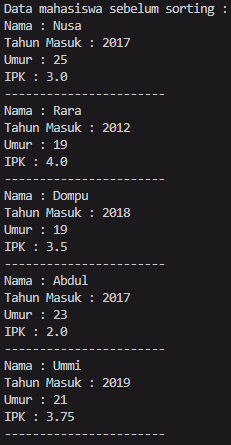
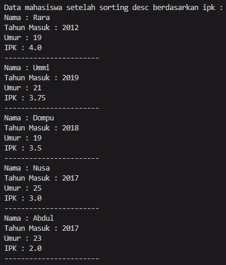
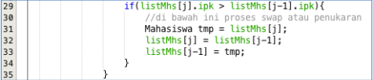
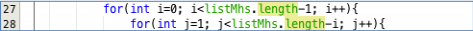
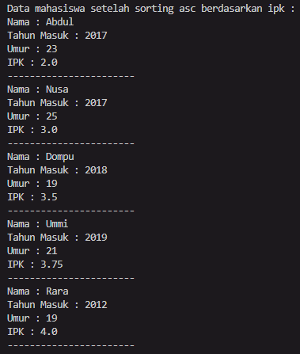
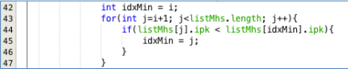
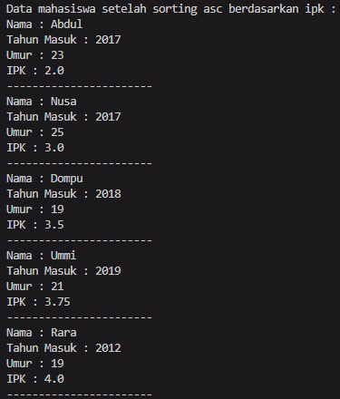
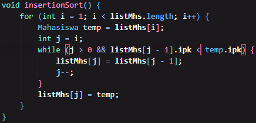

# Laporan Projek

## Percobaan 1

### Hasil Percobaan 1
> 
> 

### Pertanyaan Percobaan 1

1. Terdapat di method apakah proses bubble sort?

- Dalam method bubbleSort di class daftarMahasiswaBerprestasi

2. Di dalam method bubbleSort(), terdapat baris program seperti di bawah ini:
   > 
   > Untuk apakah proses tersebut?

- Sebagai proses penukaran urutan dari yang tertinggi ke terendah

3. Perhatikan perulangan di dalam bubbleSort() di bawah ini:
   > 

> a. Apakah perbedaan antara kegunaan perulangan i dan perulangan j?

- Perulangan i digunakan untuk jumlah pengulangan pengurutan yang dilakukan pengulangan j, yang mana pengulangan j akan dilakukan untuk mengurutkan dari yang tertinggi ke terendah

> b. Mengapa syarat dari perulangan i adalah i<listMhs.length-1 ?

- karena jika semua angka telah diurutkan, maka angka terakhir akan menjadi angka yang terkecil secara sendirinya.

> c. Mengapa syarat dari perulangan j adalah j<listMhs.length-i ?

- karena setelah pengurutan di pengulangan j telah dilakukan semua, angka pertama akan menjadi angka terbesar

> d. Jika banyak data di dalam listMhs adalah 50, maka berapakali perulangan i akan berlangsung? Dan ada berapa Tahap bubble sort yang ditempuh?

- sebanyak 49 perulangan i yang akan terjadi, dan akan ada sejumlah perulangan i tahap bubble sort yang akan ditempuh

## Percobaan 2

### Hasil percobaan 2
> 

### Pertanyaan percobaan 2

1. Di dalam method selection sort, terdapat baris program seperti di bawah ini:
   > 
   > 
    Untuk apakah proses tersebut, jelaskan!

- untuk mencari index dari nilai yang terendah

## Percobaan 3

### Hasil percobaan 3
>

### Pertanyaan percobaan 3

1. Ubahlah fungsi pada InsertionSort sehingga fungsi ini dapat melaksanakan proses sorting dengan cara descending.
> 