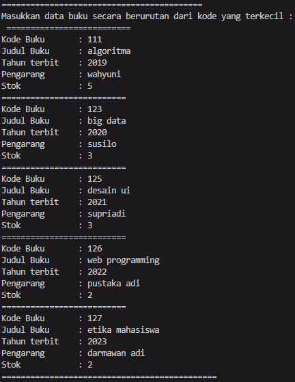
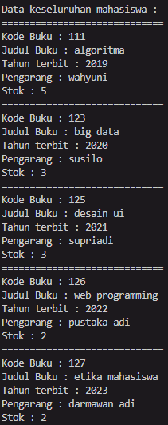
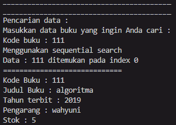
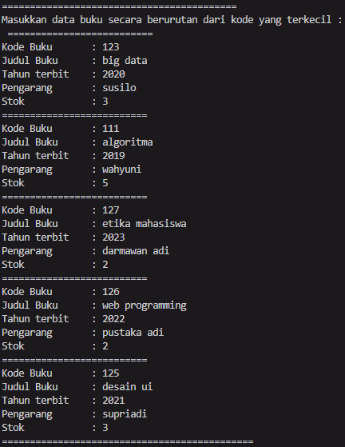
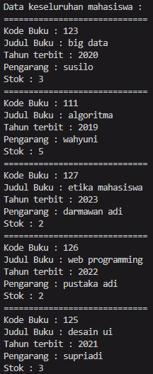
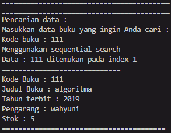
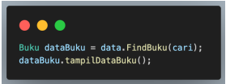
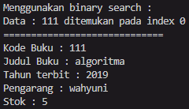
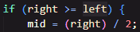
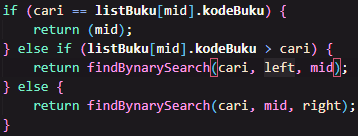

# Laporan Praktikum JobSheet 6

## Percobaan 1

### Hasil percobaan 1

> 

> 

> 

### Pertanyaan percobaan 1

1. Jelaskan fungsi break yang ada pada method FindSeqSearch!
- Untuk menghentikan segera jika yang dicari sudah ditemukan.

2. Jika Data Kode Buku yang dimasukkan tidak terurut dari kecil ke besar. Apakah program masih dapat berjalan? Apakah hasil yang dikeluarkan benar? Tunjukkan hasil screenshoot untuk bukti dengan kode Buku yang acak. Jelaskan Mengapa hal tersebut bisa terjadi?
- Program masih bisa berjalan dan hasil yang dikeluarkan juga benar sesuai urutan yang telah diisi. Hal ini bisa terjadi karena tidak ada metode sorting saat menampilkan data buku yang telah diisi.
> 
> 
> 
> 
> 
>

3. Buat method baru dengan nama FindBuku menggunakan konsep sequential search dengan tipe method dari FindBuku adalah BukuNoAbsen. Sehingga Anda bisa memanggil method tersebut pada class BukuMain seperti gambar berikut :
> 

## Percobaan 2

### Hasil percobaan 2

> 

### Pertanyaan percobaan 2

1. Tunjukkan pada kode program yang mana proses divide dijalankan!
> 

2. Tunjukkan pada kode program yang mana proses conquer dijalankan!
> 

3. Jika data Kode Buku yang dimasukkan tidak urut. Apakah program masih dapat berjalan? Mengapa demikian! Tunjukkan hasil screenshoot untuk bukti dengan kode Buku yang acak. Jelaskan Mengapa hal tersebut bisa terjadi?
- Kode akan tetap berjalan, hanya saja data tidak akan diurutkan. Diperlukan method tersendiri untuk mengurutkan data-data yang telah dimasukkan. 
> 
> 
> 
> 
> 
>

4. Jika Kode Buku yang dimasukkan dari Kode Buku terbesar ke terkecil (missal : 20215, 20214, 20212, 20211, 20210) dan elemen yang dicari adalah 20210. Bagaimana hasil dari binary search? Apakah sesuai? Jika tidak sesuai maka ubahlah kode program binary seach agar hasilnya sesuai!
- Jika dilakukan hal demikian, data tidak akan ditemukan saat program dijalankan menggunakan binary search. Perlu dilakukan pengurutan data terlebih dahulu agar data dapat ditemukan.

## Latihan

1. Modifikasi percobaan searching diatas dengan ketentuan berikut ini
- Ubah tipe data dari kode Buku yang awalnya int menjadi String
- Tambahkan method untuk pencarian kode Buku (bertipe data String) dengan menggunakan sequential search dan binary search.
2. Modifikasi percobaan searching diatas dengan ketentuan berikut ini
- Tambahkan method pencarian judul buku menggunakan sequential search dan binary search. Sebelum dilakukan searching dengan binary search data harus dilakukan pengurutan dengan menggunakan algoritma Sorting (bebas pilih algoritma sorting apapun)! Sehingga ketika input data acak, maka algoritma searching akan tetap berjalan
- Buat aturan untuk mendeteksi hasil pencarian judul buku yang lebih dari 1 hasil dalam bentuk kalimat peringatan! Pastikan algoritma yang diterapkan sesuai dengan kasus yang diberikan!