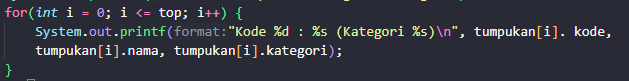
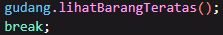
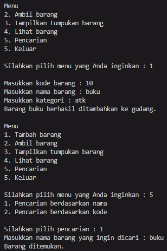

# Laporan Praktikum Jobsheet 7

## Aryo Adi Putro / 06

## Percobaan 1

### Hasil percobaan 1

> 
> 

### Pertanyaan percobaan 1

1. Lakukan perbaikan pada kode program, sehingga keluaran yang dihasilkan sama dengan verifikasi hasil percobaan! Bagian mana saja yang perlu diperbaiki?
- Bagian yang perlu diperbaiki :
> 
- Setelah perbaikan :
> 
2. Berapa banyak data barang yang dapat ditampung di dalam tumpukan? Tunjukkan potongan kode programnya!
- Data yang dapat ditampung sebanyak 7 data.

3. Mengapa perlu pengecekan kondisi !cekKosong() pada method tampilkanBarang? Kalau kondisi tersebut dihapus, apa dampaknya?
- Diperlukan pengecekan tersebut untuk mengecek apakah terdapat barang di gudang atau tidak. Jika kondisi tersebut dihapus saat tidak terdapat barang di gudang, maka method tersebut tidak akan menampilkan apa-apa. Namun, jika dilakukan pengecekan kondisi terlebih dahulu, maka kita bisa menentukan output yang akan muncul jika barang yang ada di gudang kosong.

4. Modifikasi kode program pada class Utama sehingga pengguna juga dapat memilih operasi lihat barang teratas, serta dapat secara bebas menentukan kapasitas gudang!
> 
> 

5. Commit dan push kode program ke Github
> 

## Percobaan 2

### Hasil percobaan 2

> 

### Pertanyaan percobaan 2

1. Pada method konversiDesimalKeBiner, ubah kondisi perulangan menjadi while (kode != 0), bagaimana hasilnya? Jelaskan alasannya!
- Program masih dapat berjalan. Hal tersebut terjadi karena nilai dari kode barang yang dihapus bernilai min(-). Jika memakai kode > 0, maka output dari kode uniknya null(kosong), dan jika memakai kode kode != 0, maka output dari kode uniknya bernilai min(-)

2. Jelaskan alur kerja dari method konversiDesimalKeBiner!
- Nilai yang dimasukkan dari parameter akan dicek apakah nilainya > 0 atau tidak, jika nilai > 0 maka akan melakukan perulangan. Selanjutnya nilai tersebut akan di modulus dengan 2 dan dimasukkan ke dalam variabel sisa, lalu nilainya akan di push pada method push di object stack. Setelah itu akan dibagi dengan dua dan perulangan kembali dilakukan sampai nilainya 0 (jika nilainya 0 perulangan berhenti). Lalu program mengecek apakah stack di object kosong atau tidak, jika ada isinya maka tumpukan biner teratas akan dimasukkan pada variabel biner dan program akan me-return nilai dari variabel biner tersebut.

## Percobaan 3

### Pertanyaan percobaan 3

> 

### Pertanyaan pecobaan 3

1. Pada method derajat, mengapa return value beberapa case bernilai sama? Apabila return value diubah dengan nilai berbeda-beda setiap case-nya, apa yang terjadi?
- Beberapa case memiliki return value yang sama karena kedudukannya prioritasnya yang setara seperti * dan / (setara). Jika return valuenya diubah dengan nilai berbeda-beda maka kedudukan dari setiap operator akan berbeda-beda yang dimana akan menimbulkan error dalam konversi postfixnya

2. Jelaskan alur kerja method konversi!
- Variabel P digunakan untuk menyimpan hasil dari stack yang sudah diproses di variabel c. Program melakukan perulangan sebanyak n (panjang dari String Q). char ke i pada String Q akan dimasukkan ke variabel c untuk diproses. dan prosesnya sebagai berikut :

> a. Jika adalah operand, maka langsung ditambahkan ke variabel P
>
> b. Jika c adalah '(', maka ditambahkan ke stack menggunakan method push().
>
> c. jika c adalah ')', maka semua karakter pada stack ditambahkan pada variabel P sampai '(' ditemukan dan '(' kemudian dihapus dari stack dengan method pop().
>
> d. jika c adalah operator, maka char operator pada stack dengan kedudukan prioritas yang lebih tinggi ditambah di variabel P sampai char operator yang lebih rendah atau sama ditemukan dan operator tersebut kemudian ditambahkan menggunakan method push().
- Setelah semua iterasi selesai, method mereturn nilai pada variabel P

3. Pada method konversi, apa fungsi dari potongan kode berikut?
> 
- Memasukkan char ke i pada String Q ke dalam variabel c (i sesuai dengan iterasinya dalam perulangan).

## Latihan

1. Perhatikan dan gunakan kembali kode program pada Percobaan. Tambahkan dua method berikut pada class Gudang:
- Method lihatBarangTerbawah digunakan untuk mengecek barang pada tumpukan terbawah
``` java
void lihatBarangTerbawah() {
        for(int i = 0; i < size; i++) {
            if(tumpukan[i] != null) {
                System.out.println("Barang terbawah : " + tumpukan[i].nama);
                break;
            } else {
                System.out.println("Tumpukan barang kosong.");
            }
        }
    }
```
> 

- Method cariBarang digunakan untuk mencari ada atau tidaknya barang berdasarkan kode barangnya atau nama barangnya
``` java
boolean cariNama(String nama, int mulai) {
        if(nama.equalsIgnoreCase(tumpukan[mulai].nama)) {
            System.out.println("Barang ditemukan.");
            return true;
        } else {
            return cariNama(nama, mulai+1);
        }
    }

    boolean cariKode(int kode, int mulai) {
        if(kode == tumpukan[mulai].kode) {
            System.out.println("Barang ditemukan.");
            return true;
        } else {
            return cariKode(kode, mulai+1);
        }
    }
```
> 
> 